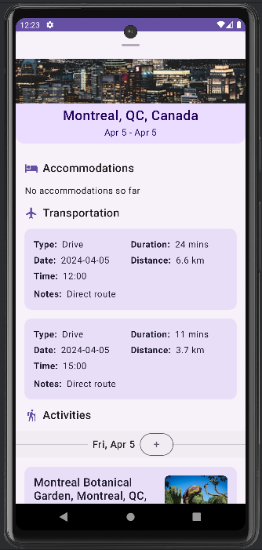

# Trekly

## Product Description
A collaborative AI travel planner with travel tips, itinerary suggestions, and route planning.

## Screenshots

  <table>
    <tr>
      <td>
        
         
        <em>Home page</em>
      </td>
      <td>
        
         
        <em>Map view</em>
      </td>
      <td>
        
         
        <em>Itinerary view</em>
      </td>
    </tr>
  </table>

## Team 101-2
* Kevin Lu (q48lu@uwaterloo.ca)
* Tanisha Dhami (tsdhami@uwaterloo.ca)
* Helen Xia (y95xia@uwaterloo.ca)
* Daniel Fang (zmfang@uwaterloo.ca)

## Links
* [User Documentation](https://git.uwaterloo.ca/zmfang/team-101-2/-/wikis/User-documentation)

* [Design Documentation](https://git.uwaterloo.ca/zmfang/team-101-2/-/wikis/Design-documents)

* [Project Proposal](https://git.uwaterloo.ca/zmfang/team-101-2/-/wikis/Project-Proposal)

* [Meeting Minutes](https://git.uwaterloo.ca/zmfang/team-101-2/-/wikis/Meeting-minutes)

* Developer Journals:
  * [Development Journal - Kevin](https://git.uwaterloo.ca/zmfang/team-101-2/-/wikis/Development-journal-Kevin)
  * [Development Journal - Tanisha](https://git.uwaterloo.ca/zmfang/team-101-2/-/wikis/Development-journal-Tanisha)
  * [Development Journal - Helen](https://git.uwaterloo.ca/zmfang/team-101-2/-/wikis/Development-Journal-Helen)
  * [Development Journal - Daniel](https://git.uwaterloo.ca/zmfang/team-101-2/-/wikis/Development-Journal-Daniel)

## Releases

[Link to all releases](https://git.uwaterloo.ca/zmfang/team-101-2/-/releases)

### 1.0.0
Date: February 16, 2024

[Link to release](https://git.uwaterloo.ca/zmfang/team-101-2/-/releases/1.0.0)

Major changes
- Login feature supporting sign-ups + email confirmation
- Recommender tab: to communicating with ChatGPT for travel ideas
- Map tab: to display area view of planned itinerary
- Itinerary tab: to create itineraries with name, destination and date range

### 2.0.0
Date: March 8, 2024

[Link to release](https://git.uwaterloo.ca/zmfang/team-101-2/-/releases/2.0.0)

Major changes
- Login feature supporting logins, sign-up, and login error checking
- Google Maps now displays the user's current location, all of an itinerary' activities, and routes between them
- UI is created for the homepage of the itinerary
- Housekeeping - refactored project structure so it follows MVVM

### 3.0.0
Date: March 22, 2024

[Link to release](https://git.uwaterloo.ca/zmfang/team-101-2/-/releases/3.0.0)

Major changes
- New user flow, no bottom nav bar, all merged into one!
- Supports signup to login flow, as well as logout
- Google Maps view now displays numbers on different activities based on the order of events
- Show recommendations marker window the same way activity markers are shown (with pictures & everything)
- The itinerary page is now prettier and more user-friendly

### 4.0.0
Date: April 5, 2024

[Link to release](https://git.uwaterloo.ca/zmfang/team-101-2/-/releases/4.0.0)

Major changes
- Google Maps Places autocomplete for place text fields
- Ability to add new Activities to an Itinerary
- New itineraries have a picture associated with the itinerary's destination
- The itinerary and map can now be viewed together
- Trekly logo!
- Recommendation feature when creating a new itinerary
- New users get to indicate their travel preferences
- Profile page for user
